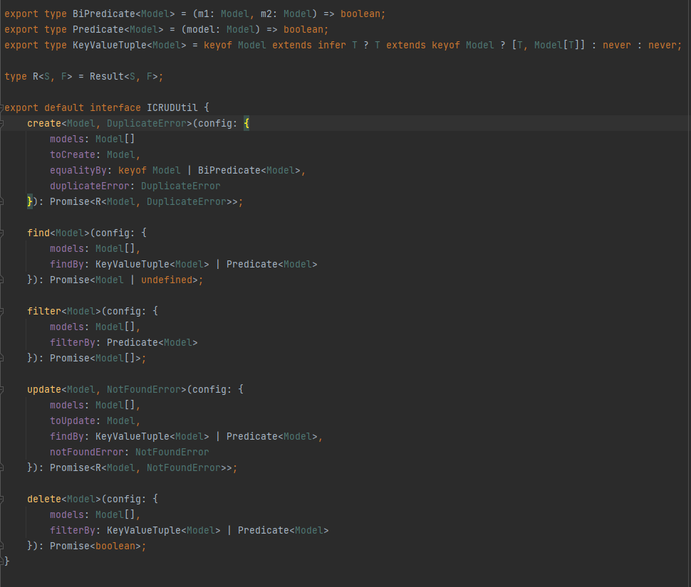
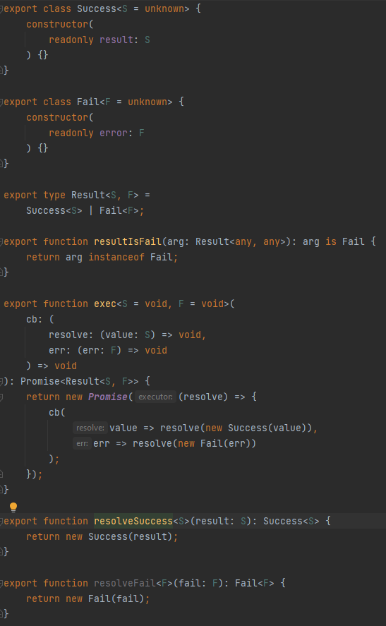

# 1. Individual Contributions
## a. What did I work on?
- I am the lead for all api related code, so besides the code that I write myself I check 100% of the code.
It also means that I am responsible for the architectural decisions and coding patterns.
- Following repositories:
  - user
  - userExercise
  - userRefreshTokens
  - workoutLog
  - exerciseCategory
- All utils, so among others:
  - CRUDUtil
  - FailOrSuccess
- DI setup using TSyringe
- Auth using JWT
- Unit tests
## b. Who did you collaborate with on it?
I collaborated with Soufiane Amaador as him and me are the main api developers.
## c. What fraction of your effort went to each of those parts (approximately)?
Auth took the longest. My knowledge on it was not substantial
so I had to spend time on research. The others all took an even amount of effort.
## d. Which part took you an inordinate amount of time?
Like I said, auth.

# 2. Code snippet(s)
Not sure what the difference is between the supposed "best quality" and "highest complexity"
as stated in the assignment description, so I just merged them together into one single
section.

- CRUDUtil

  Library which I created for resolving the growing issue of code duplication whilst 
we were adding more and more in-memory repositories.

  The corresponding code is a nice example of a complex application of Typescript generics.

- FailOrSuccess

  Another library which I created. This one solves two problems:
  - It provides a common interface to be used whenever a method has a success-scenario and a fail-scenario,
  which is common for our repository methods. The library provides
  a function ("resultIsFail") for narrowing the result to either the success-type or fail-type.
  Usage of this function is obligatory for client code in order to satisfy compiler type rules.
  The pattern is inspired by Java checked exceptions.
  - The error types for ES6 Promises cannot be typed in Typescript. Instead of returning promises
  directly, methods may return a FailOrSuccess.Result wrapped inside of a Promise in order
  to have error typings anyway.

3. Unit tests
Please see the unit test for CRUDUtil.